

# 🪲 Beetle Math Lab

## 獨角仙妹妹的數學思考漫畫

### Factors & Multiples Foundation｜因數與倍數 N-0 地基篇
### Factors & Multiples｜因數與倍數篇
### Multiples Detective｜倍數偵探篇
### Fraction Division Foundation｜分數除法 N-0 地基篇
### Fraction Division｜分數除法篇

> **不急著背口訣，先把地基蓋好，再看懂規則為什麼成立。**

---

## 🌸 這裡記錄什麼？

這是獨角仙妹妹的數學學習紀錄。

在進入課本的新觀念以前，我們先用 **N-0 地基漫畫**，把容易混淆的基礎概念一個一個補起來：

- 什麼叫「剛好分完」？
- 乘法和分組有什麼關係？
- 什麼是因數？什麼是倍數？
- 分數除法其實在問什麼？
- 為什麼除以分數最後會變成乘以倒數？

地基穩固以後，再進入因數、倍數與分數除法的新觀念。這裡不只記錄答案，也保留思考、拆解、驗算與重新推理的過程。

---

## 🧱 因數與倍數 N-0 地基漫畫

### 1-0-1｜什麼叫剛好分完？

從 12 顆草莓開始分組：每組 2 顆或 3 顆都沒有剩下；每組 5 顆會剩下 2 顆。先看懂「沒有剩下」，才開始學整除、因數和倍數。

### 1-0-2｜乘法和分組有什麼關係？

同樣是 12 顆草莓，可以看成 3 組、每組 4 顆，也可以看成 4 組、每組 3 顆。乘法是在記錄「幾組、每組幾個」。

### 1-0-3｜因數：把一個數往裡拆

想找 12 的因數，就找哪些數可以兩兩相乘得到 12。能剛好乘出 12 的 1、2、3、4、6、12，都是 12 的因數。

### 1-0-4｜倍數：從一個數往外長

從 3 出發，一組一組往外增加，就會得到 3、6、9、12、15……這些都是 3 的倍數。

### 1-0-5｜同一個乘法，同時看到因數和倍數

在 `3 × 4 = 12` 裡，往結果 12 裡面拆，可以看到 3、4 是 12 的因數；從 3 或 4 往外長，也可以看到 12 是它們的倍數。

### 1-0-6｜因數、倍數生活辨認遊戲

用餅乾分包、糖果分盤和數字往外長的生活題，練習判斷現在是在「往裡拆、想因數」，還是「往外長、想倍數」。

---

## 🌿 因數與倍數新觀念漫畫

### 1-1｜質數和合數

### 1-2｜質因數和質因數分解

### 1-3｜最大公因數

### 1-4｜最小公倍數

---

## 🔎 倍數偵探漫畫

### ① 什麼是倍數？

### ② 為什麼留下 1 位或 2 位？

### ③ 三種十進位整包

### ④ 2、5、4 留下幾位？

### ⑤ 8 為什麼看末三位？

### ⑥ 9 和 3 為什麼把數字加起來？

### ⑦ 兩關任務與偵探地圖

---

## 🧱 分數除法 N-0 地基漫畫

### 2-0-1｜除法不只是在平均分

從「6 塊餅乾，每 2 塊裝一包」走到「3 裡面有幾個二分之一」。看懂除法也可以是在問：**總量裡面包含幾個這樣大小的份量？**

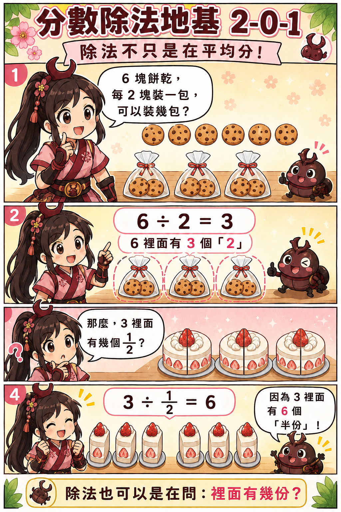

### 2-0-2｜先找出一樣大的小格子

要找四分之三裡有幾個八分之一，先把四分之一切成兩個八分之一，將兩邊換成相同的小單位；`3/4 = 6/8`，所以共有 6 個八分之一。

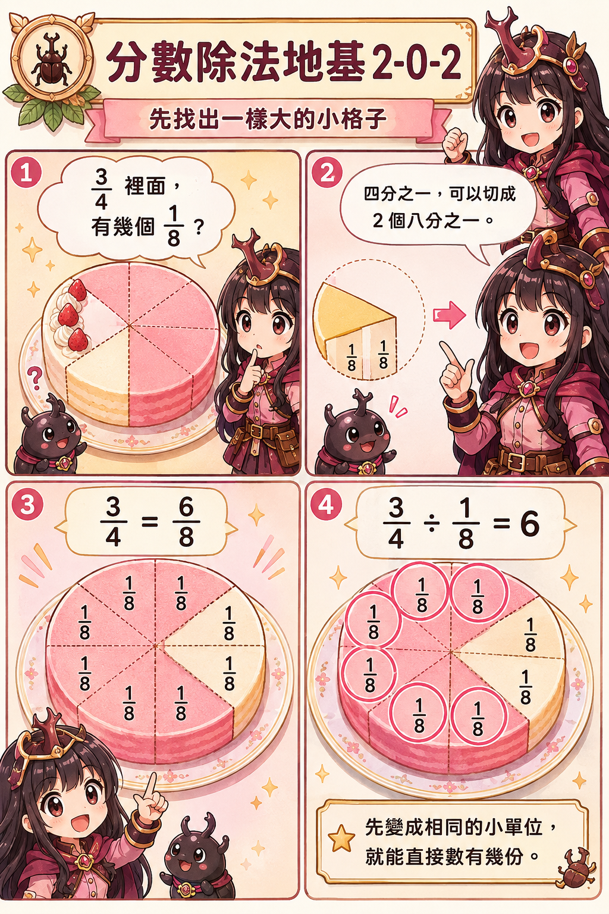

### 2-0-3｜為什麼除以分數會變成乘法？

用 `3/4 ÷ 2/5` 拆解「裡面有幾個五分之二」。先換成五分之一來計數，再除以每 2 小份為一組，推得 `3/4 × 5/2 = 15/8`。倒過來乘不是魔法口訣，而是在更換計數單位。

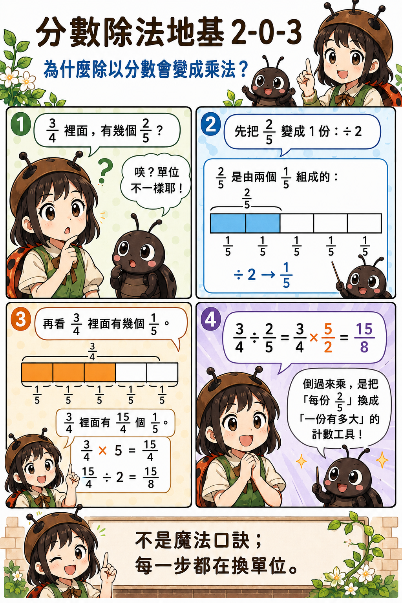

---

## 🌱 分數除法新觀念漫畫

### 2-1｜最簡分數

找出分子與分母的最大公因數，再讓分子、分母一起除以它；最後確認兩者只剩公因數 1，就得到最簡分數。

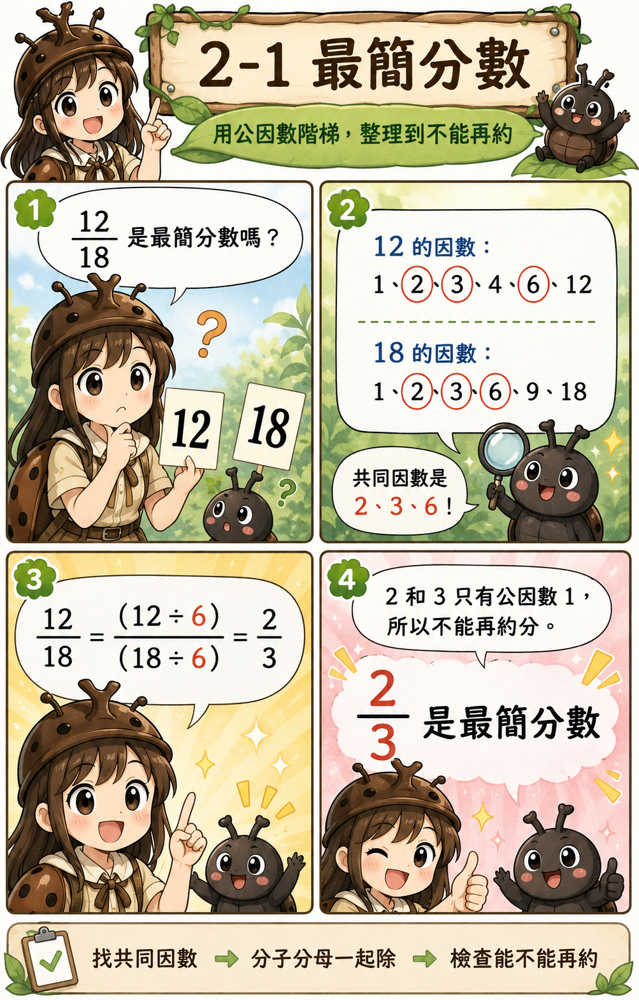

### 2-2｜同分母分數的除法

分數單位相同時，可以直接比較分子所代表的份數。`5/6 ÷ 1/6 = 5`，因為五個六分之一裡面有 5 個六分之一。

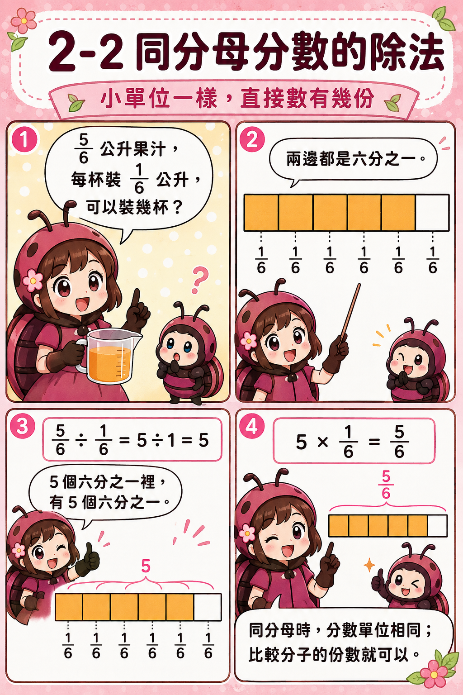

### 2-3｜異分母分數的除法

分數單位不同時要先通分。`3/4 = 6/8`，所以 `3/4 ÷ 1/8 = 6`；再用乘法 `6 × 1/8 = 3/4` 回頭檢查。

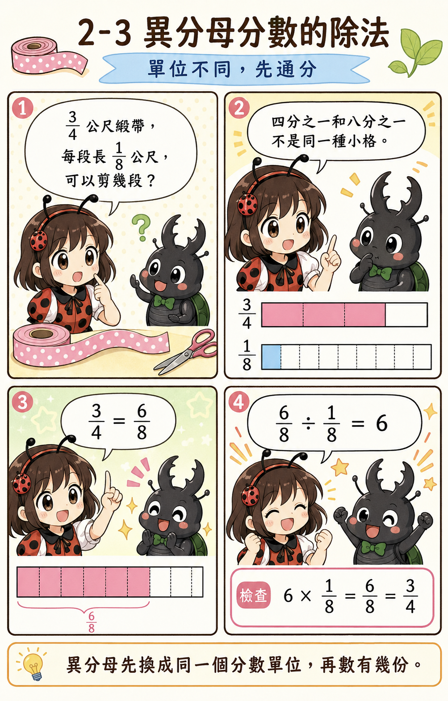

### 2-4｜有餘數的分數除法

`7/8` 公升果汁，每瓶裝 `1/4` 公升。先把每瓶的 `1/4` 換成 `2/8`，再把 7 個八分之一每 2 個分成一組：可以裝滿 3 瓶，剩下 `1/8` 公升。商回答完整裝滿幾份，餘數則要保留原來的公升單位。

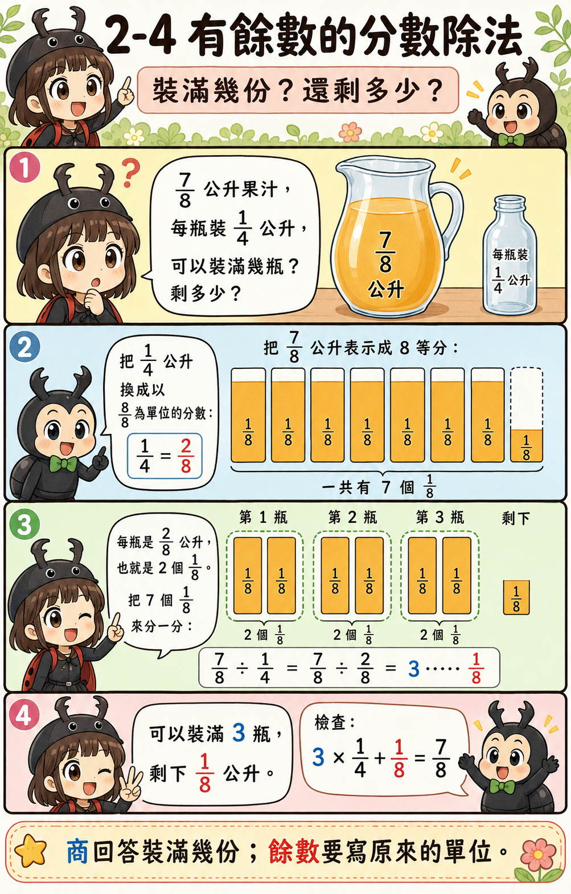

### 2-5①｜分數除法的應用：總量 ÷ 每份量

把 `2又1/4` 公尺的緞帶，每 `3/8` 公尺做一個蝴蝶結。先把帶分數化成假分數，再用「總量 ÷ 每份量」算出可以做 6 個。

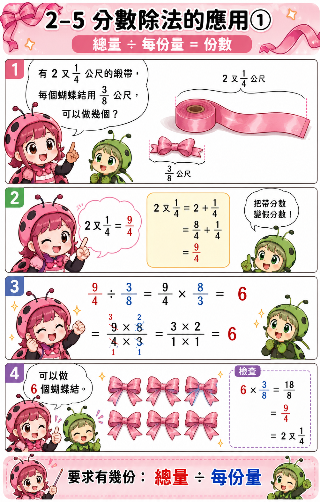

### 2-5②｜分數除法的應用：部分量 ÷ 所占分率

已知 `5/6` 公斤是整袋的 `2/3`，用「部分量 ÷ 所占分率」反求整體量，得到 `5/4 = 1又1/4` 公斤。

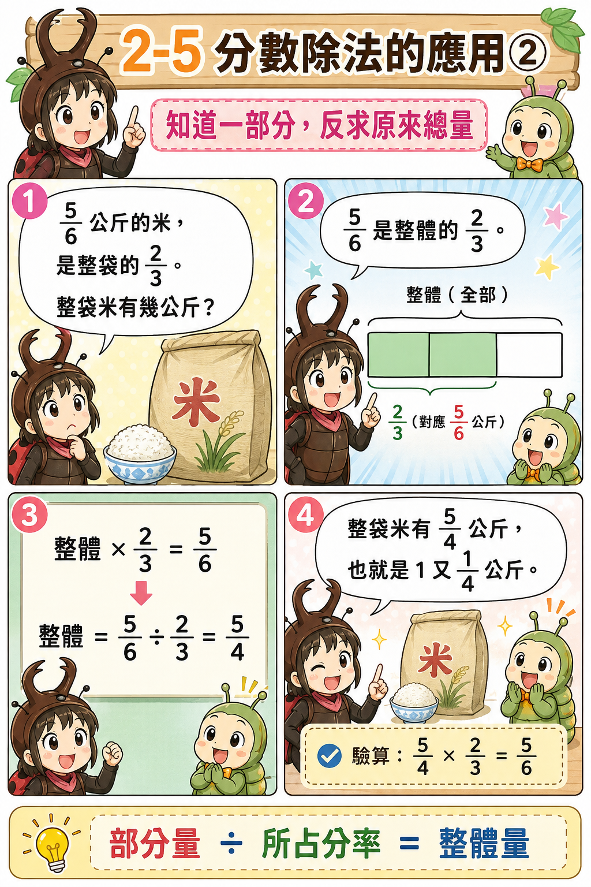

### 2-6①｜除法不一定會變小

商的大小取決於「每一份有多大」：除數大於 1，商比被除數小；除數等於 1，商不變；除數介於 0 和 1 之間，商反而比被除數大。

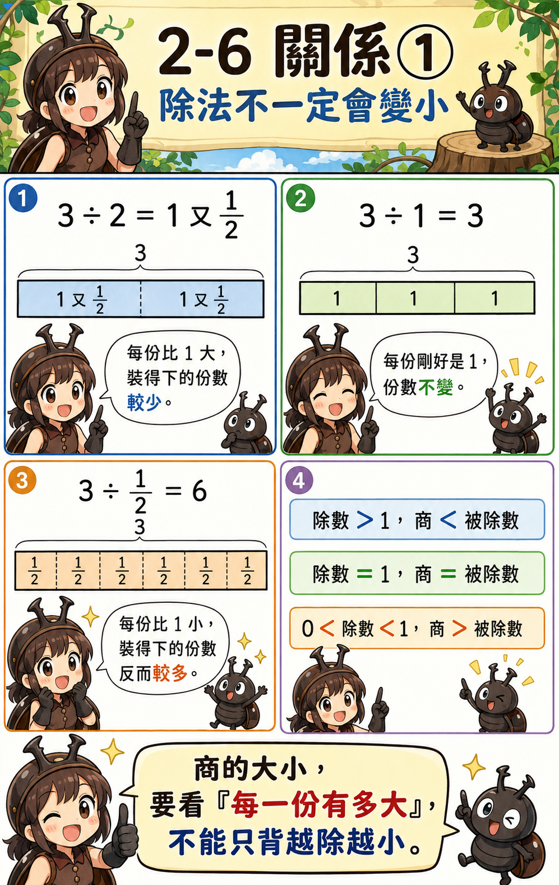

### 2-6②｜除法和乘法可以互相檢查

利用「商 × 除數 = 被除數」回頭驗算。算完不是結束；看單位、算答案，再用乘法檢查，才能知道模型有沒有站穩。

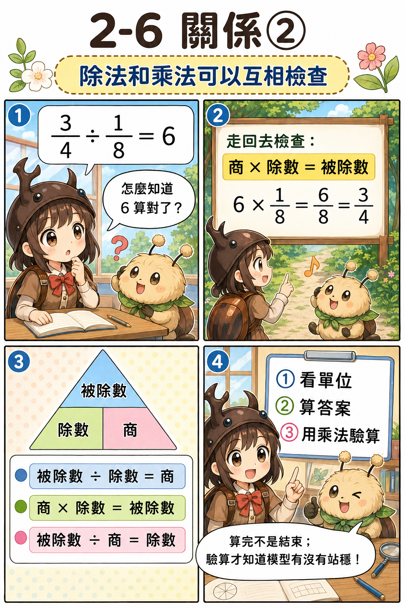

---

## 🌱 我們的學習方式

1. **先補地基**：先看懂問題到底在問「分成幾份」還是「裡面有幾份」。
2. **先統一單位**：分數單位不同，就先通分成一樣大的小格子。
3. **再數有幾份**：單位相同後，再比較有幾個相同的小份。
4. **理解倒數**：除以分數變成乘以倒數，是更換計數單位，不是魔法口訣。
5. **觀察合理性**：除數小於 1 時，商可能變大。
6. **乘法驗算**：用「商 × 除數 = 被除數」檢查答案。
7. **重新推理**：忘記公式沒關係，可以重新畫格子、換單位、數份數。

---

### 🪲 往裡拆，找到因數；往外長，找到倍數。

### 分數除法不是魔法口訣，而是在問：裡面有幾份？

### 真正的偵探，不只記得規則，也知道規則為什麼成立。

