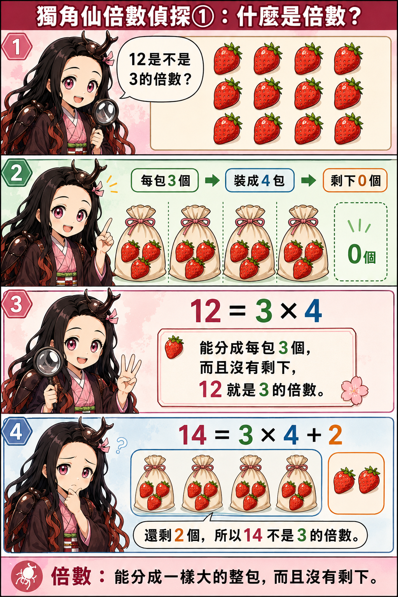
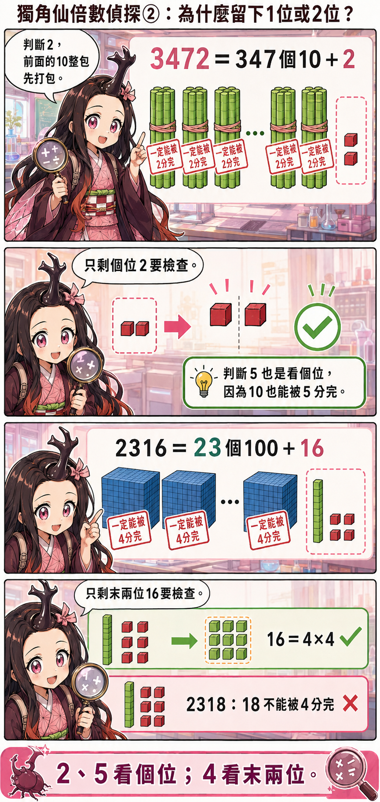
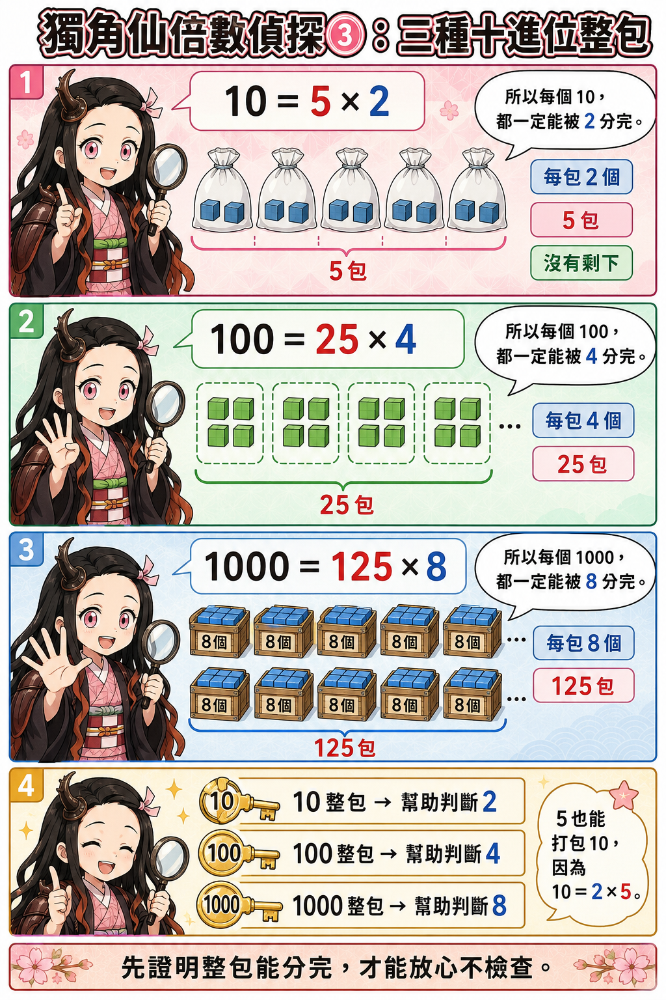
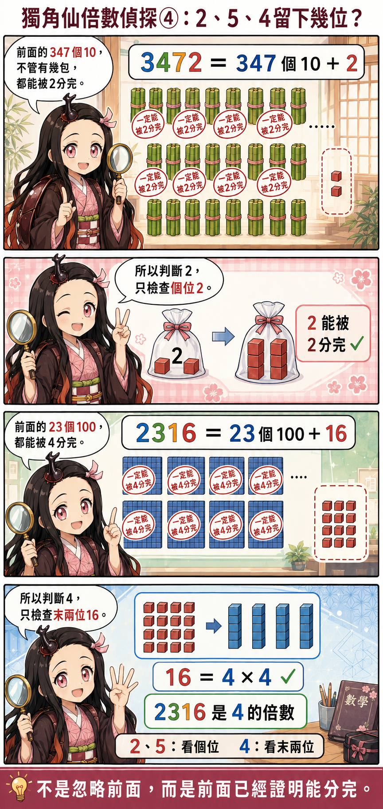
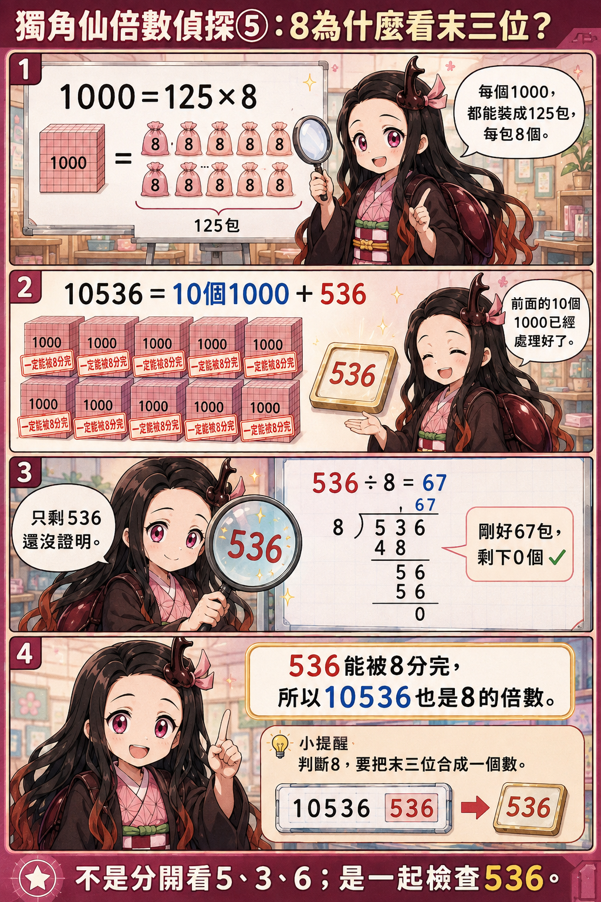
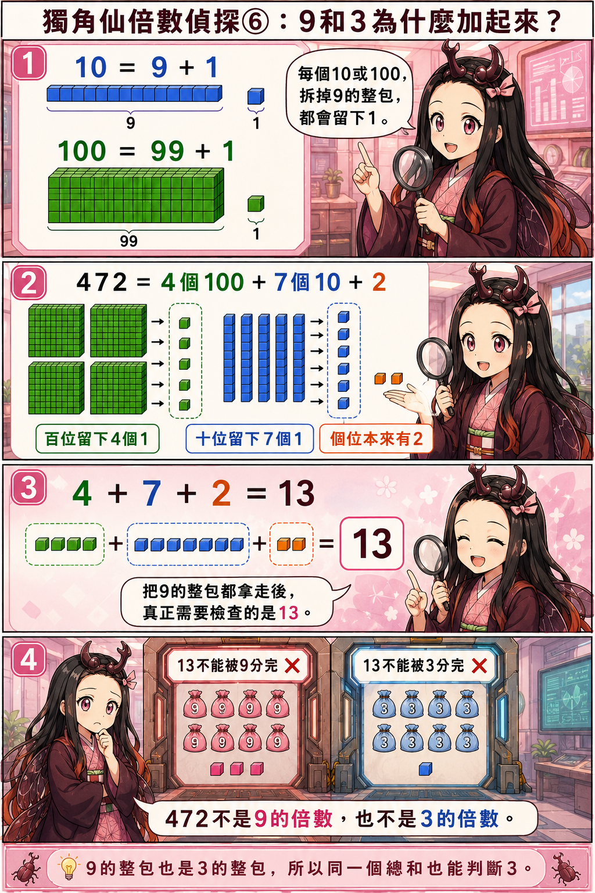
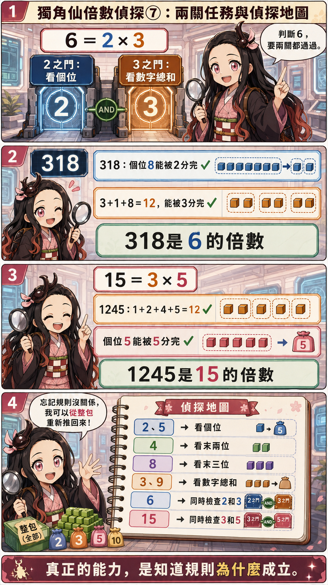

<div align="center">

# 🪲 Beetle Math Lab

## 獨角仙妹妹的數學思考漫畫

### Multiples Detective｜倍數偵探篇

> **不急著背口訣，先看懂規則為什麼成立。**

</div>

---

## 🌸 這裡記錄什麼？

這是獨角仙妹妹的數學學習紀錄。

我們把抽象的數字變成可以看見的「積木」與「整包」，陪妹妹一步一步理解：

- 什麼是倍數？
- 為什麼判斷倍數時，可以只檢查最後幾位？
- 前面的數字真的被忽略了嗎？
- 2、3、4、5、6、8、9、15 的倍數規則為什麼成立？

這裡不只記錄答案，也保留思考、拆解與重新推理的過程。

---

## 🎒 先認識「整包」

例如，12 顆草莓每 3 顆裝成一包，可以剛好裝成 4 包，沒有剩下：

```text
12 = 3 × 4
```

所以，**12 是 3 的倍數**。

漫畫裡說的「打包」，就是把一群東西按照相同數量分成一包；如果全部都能裝完、沒有剩下，就代表它能被這個數整除。

而「十進位整包」是利用：

```text
10 = 2 × 5
100 = 4 × 25
1000 = 8 × 125
```

因此：

- 每個 10 一定能被 2 和 5 分完。
- 每個 100 一定能被 4 分完。
- 每個 1000 一定能被 8 分完。

前面的數字不是消失，也不是被忽略，而是它們已經被證明能完整分包，所以只需繼續檢查尚未確定的部分。

---

## 🔎 倍數偵探漫畫

### ① 什麼是倍數？

先從草莓分包開始，理解「倍數」就是能分成一樣大的整包，而且沒有剩下。



---

### ② 為什麼留下1位或2位？

看懂前面的十位或百位為什麼能先打包，以及真正還需要檢查的是哪一部分。



---

### ③ 三種十進位整包

利用 10、100、1000，分別找出判斷 2、4、5、8 的線索。



---

### ④ 2、5、4留下幾位？

判斷 2 和 5，只要檢查個位；判斷 4，則要把末兩位合起來檢查。



---

### ⑤ 8為什麼看末三位？

因為每個 1000 都能被 8 分完，所以前面的千位整包可以先處理，只需檢查末三位組成的數。



---

### ⑥ 9和3為什麼把數字加起來？

每個 10、100、1000 拆掉 9 的整包後，都會留下 1；這些留下來的數量加總，正好就是各位數字的總和。



---

### ⑦ 兩關任務與偵探地圖

判斷 6 要同時通過 2 和 3 兩關；判斷 15 則要同時通過 3 和 5 兩關。最後把整套推理整理成偵探地圖。



---

## 🧭 倍數偵探地圖

| 要判斷的倍數 | 檢查方式 | 為什麼？ |
|---|---|---|
| 2 | 看個位 | 10 能被 2 分完 |
| 5 | 看個位 | 10 能被 5 分完 |
| 4 | 看末兩位 | 100 能被 4 分完 |
| 8 | 看末三位 | 1000 能被 8 分完 |
| 3 | 看各位數字總和 | 十進位整包除以 3 都會留下可加總的 1 |
| 9 | 看各位數字總和 | 十進位整包除以 9 都會留下可加總的 1 |
| 6 | 同時通過 2 和 3 | 6 = 2 × 3，而且 2、3 沒有共同因數 |
| 15 | 同時通過 3 和 5 | 15 = 3 × 5，而且 3、5 沒有共同因數 |

---

## 🌱 我們的學習方式

1. **先看見**：用草莓、積木和袋子，把數字變成具體的東西。
2. **再分包**：找出哪些部分一定能完整分完。
3. **找剩下**：只檢查還沒有被證明的部分。
4. **說出原因**：不只回答結果，也試著解釋規則為什麼成立。
5. **重新推理**：忘記口訣沒關係，可以從整包概念再推一次。

---

<div align="center">

### 🪲 真正的偵探，不只記得規則，也知道規則為什麼成立。

</div>
