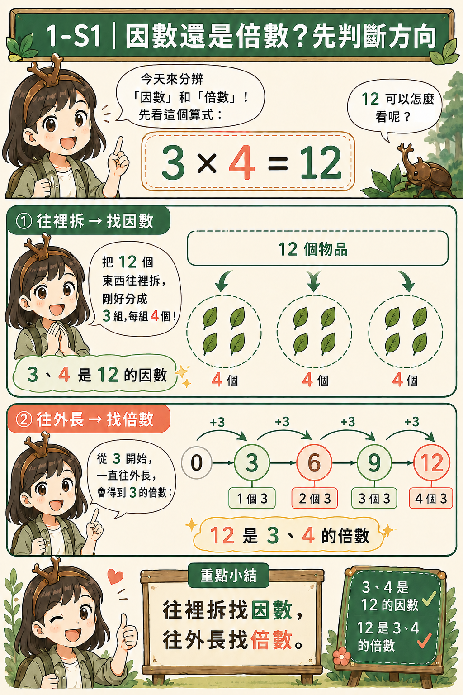
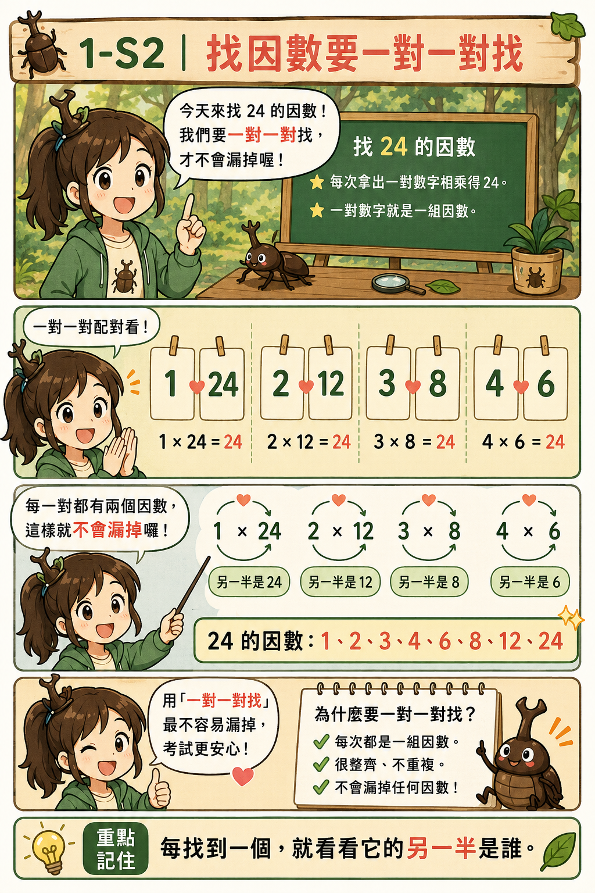
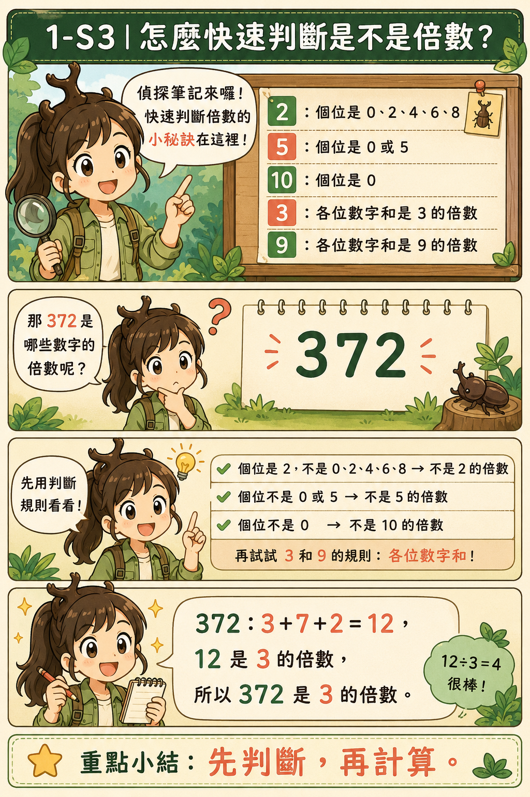
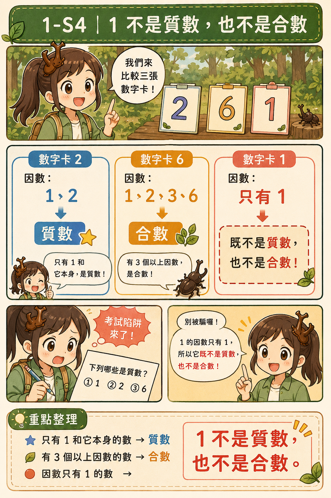
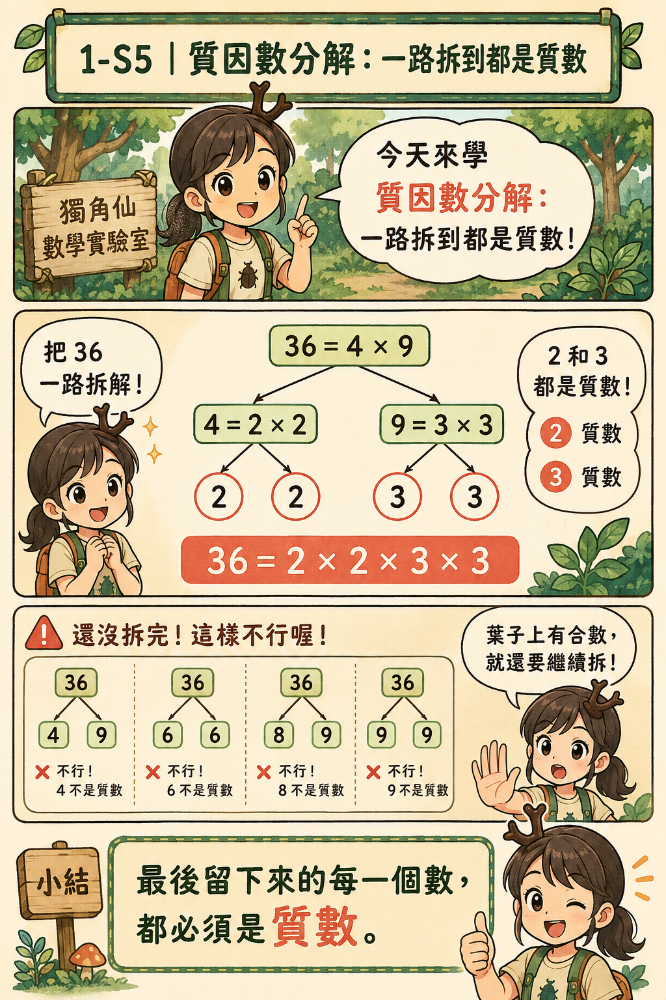
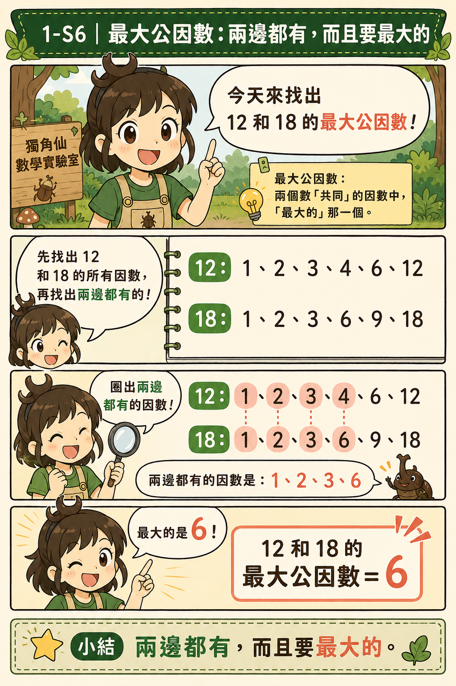
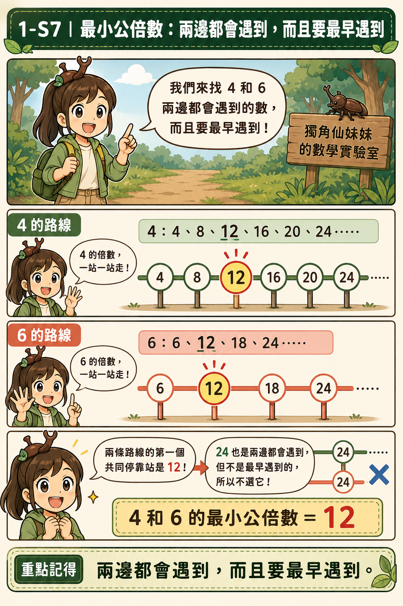
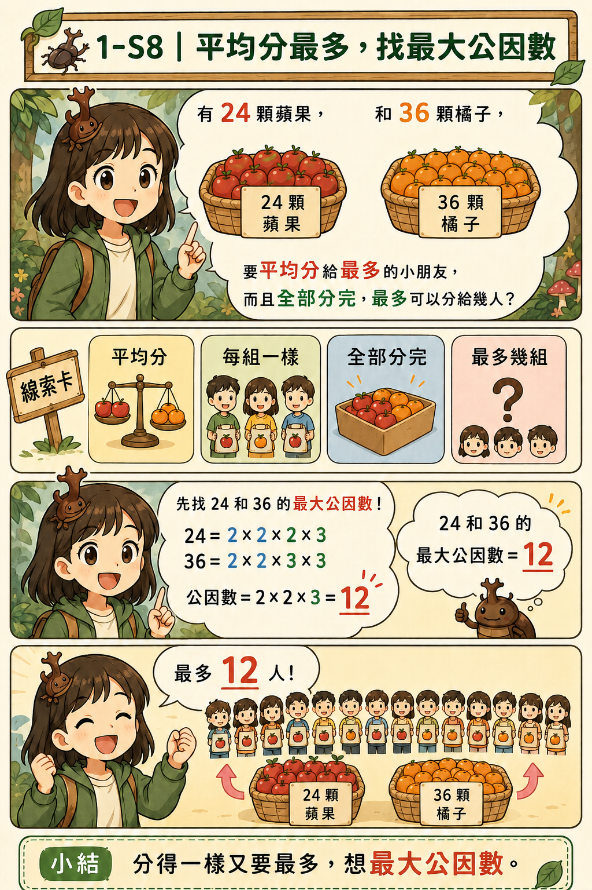
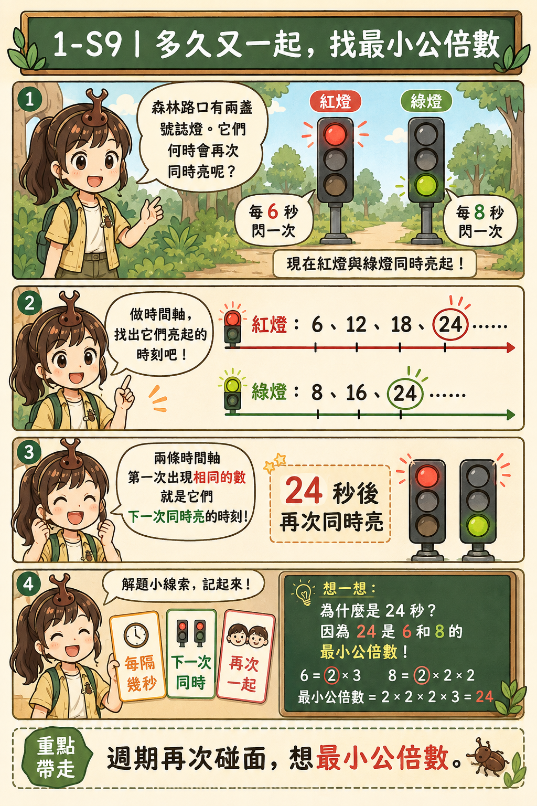
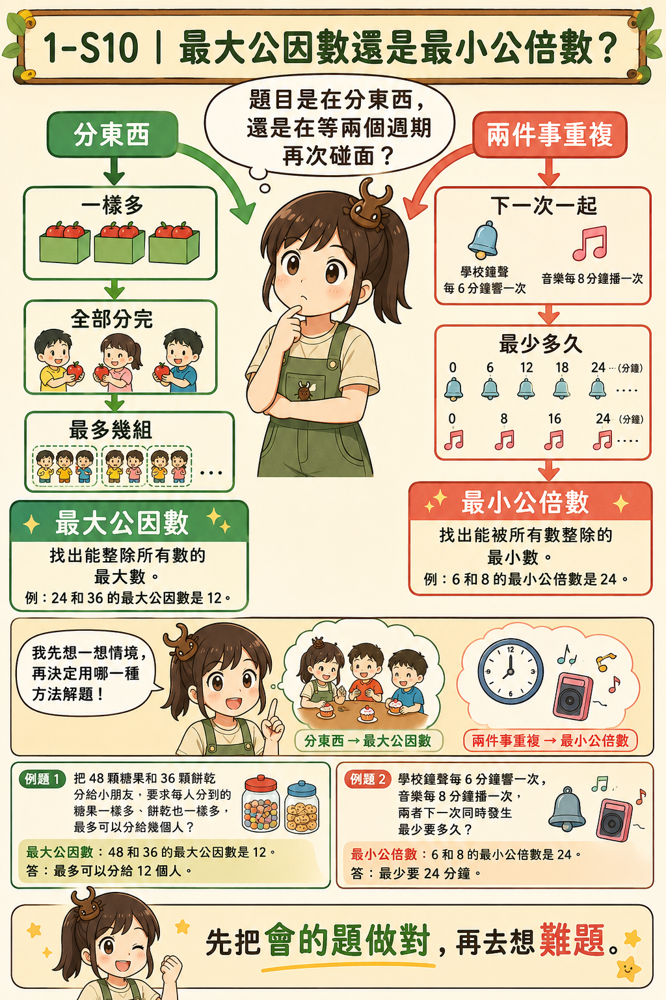

# 🪲 Beetle Math Lab

## 獨角仙妹妹的數學思考漫畫

### Factors & Multiples Foundation｜因數與倍數 N-0 地基篇
### Factors & Multiples｜因數與倍數篇
### Multiples Detective｜倍數偵探篇
### Fraction Division Foundation｜分數除法 N-0 地基篇
### Fraction Division｜分數除法篇

> **不急著背口訣，先把地基蓋好，再看懂規則為什麼成立。**

---

## 🌸 這裡記錄什麼？

這是獨角仙妹妹的數學學習紀錄。

在進入課本的新觀念以前，我們先用 **N-0 地基漫畫**，把容易混淆的基礎概念一個一個補起來：

- 什麼叫「剛好分完」？
- 乘法和分組有什麼關係？
- 什麼是因數？什麼是倍數？
- 分數除法其實在問什麼？
- 為什麼除以分數最後會變成乘以倒數？

地基穩固以後，再進入因數、倍數與分數除法的新觀念。這裡不只記錄答案，也保留思考、拆解、驗算與重新推理的過程。

---

## 🎯 第一單元｜因數與倍數：70 分必拿漫畫

這一區不是要挑戰最難的題目。

我們先把考卷裡最常出現、最值得拿到的基本分抓穩。

妹妹這一單元先守住：

- 看得懂因數和倍數
- 找得出一個數的因數
- 判斷是不是倍數
- 分得清質數和合數
- 做得出基本質因數分解
- 找得到最大公因數
- 找得到最小公倍數
- 看得懂「分東西」和「週期重複」是哪一種題型
- 做完知道怎麼檢查

> **先把會的題做對，再去想難題。**

### 🎯 1-S1｜因數還是倍數？先判斷方向

看到題目先不要急著算。

如果是在問：「這個數可以被哪些數剛好分完？」就是往裡拆，找 **因數**。

如果是在問：「從這個數一直乘 1、2、3、4……會得到哪些數？」就是往外長，找 **倍數**。

例如：

`3 × 4 = 12`

可以同時看見：

- 3、4 是 12 的因數
- 12 是 3、4 的倍數

> **往裡拆找因數，往外長找倍數。**

### 🎯 1-S2｜找因數要一對一對找

題目問：「24 的因數有哪些？」

不要從 1 寫到 24 一個一個試。先找乘法配對：

`1 × 24`　`2 × 12`　`3 × 8`　`4 × 6`

所以 24 的因數是：

`1、2、3、4、6、8、12、24`

> **每找到一個，就看看它的另一半是誰。**

這樣比較不容易漏掉。

### 🎯 1-S3｜怎麼快速判斷是不是倍數？

看到大數字，不一定要真的做除法。先用最常考的基本規則：

- 2 的倍數：個位是 `0、2、4、6、8`
- 5 的倍數：個位是 `0 或 5`
- 10 的倍數：個位是 `0`
- 3 的倍數：所有數字加起來是 3 的倍數
- 9 的倍數：所有數字加起來是 9 的倍數

例如：

`372`

`3 + 7 + 2 = 12`

12 是 3 的倍數，所以 372 也是 3 的倍數。

> **先判斷，再計算，可以省很多時間。**

### 🎯 1-S4｜1 不是質數，也不是合數

質數只有兩個因數：`1 和自己`

例如：

- 2：因數只有 1、2
- 3：因數只有 1、3
- 5：因數只有 1、5

所以它們是質數。

合數有三個以上的因數。例如 6 的因數有 `1、2、3、6`，所以 6 是合數。

但是 1 只有一個因數，所以：

> **1 不是質數，也不是合數。**

這是考卷很喜歡出的陷阱。

### 🎯 1-S5｜質因數分解：一路拆到全部都是質數

例如 36 可以先拆成：

`36 = 4 × 9`

再繼續拆：

`4 = 2 × 2`

`9 = 3 × 3`

所以：

`36 = 2 × 2 × 3 × 3`

最後要檢查：

> **留下來的每一個數，都必須是質數。**

如果最後還看到 4、6、8、9，表示還沒有拆完。

### 🎯 1-S6｜最大公因數：兩邊都有，而且要最大的

例如找 12 和 18 的最大公因數。

12 的因數：`1、2、3、4、6、12`

18 的因數：`1、2、3、6、9、18`

兩邊都有：`1、2、3、6`

其中最大的是 6，所以：

`12 和 18 的最大公因數 = 6`

> **公因數＝兩邊都有。**
>
> **最大公因數＝兩邊都有裡面最大的。**

### 🎯 1-S7｜最小公倍數：兩邊都會遇到，而且要最早遇到

例如找 4 和 6 的最小公倍數。

4 的倍數：`4、8、12、16、20、24……`

6 的倍數：`6、12、18、24……`

兩邊第一次共同出現的是 12，所以：

`4 和 6 的最小公倍數 = 12`

> **公倍數＝兩邊都有。**
>
> **最小公倍數＝第一個共同遇到的倍數。**

### 🎯 1-S8｜「平均分最多」常常找最大公因數

題目：有 24 顆蘋果和 36 顆橘子，要平均分給最多的小朋友；每個人的蘋果一樣多，橘子也一樣多，而且全部分完。

這時候是在找：

> **24 和 36 可以同時被多少人剛好分完？**

所以找 **最大公因數**。

24 和 36 的最大公因數是 12，所以最多可以分給 12 人。

看到以下線索，先想會不會是在找最大公因數：

- 平均分
- 每組一樣
- 全部分完
- 最多幾組
- 最大邊長

### 🎯 1-S9｜「多久又一起」常常找最小公倍數

題目：紅燈每 6 秒亮一次，綠燈每 8 秒亮一次。現在同時亮，幾秒後會再同時亮？

紅燈：`6、12、18、24……`

綠燈：`8、16、24……`

第一次又一起出現是 24，所以答案是 `24 秒`。

看到以下線索，先想會不會是在找最小公倍數：

- 每隔幾分鐘
- 每幾天一次
- 下一次同時
- 再次一起
- 最少多久

### 🎯 1-S10｜最大公因數和最小公倍數不要選反

妹妹最後只要先問兩個問題：

#### 問題一

「我要把東西分成一樣多的組，而且全部分完嗎？」

如果是，常常找 **最大公因數**。

#### 問題二

「兩件事情一直重複，我要找下一次一起發生嗎？」

如果是，常常找 **最小公倍數**。

但是不要只看到關鍵字就立刻套公式，還要問：

> **題目到底是在分東西，還是在等兩個週期再次碰面？**

### ✅ 第一單元考前檢查

- [ ] 我知道什麼是因數
- [ ] 我知道什麼是倍數
- [ ] 我會成對找因數
- [ ] 我會判斷 2、3、5、9、10 的倍數
- [ ] 我知道 1 不是質數也不是合數
- [ ] 我會做基本質因數分解
- [ ] 我會找最大公因數
- [ ] 我會找最小公倍數
- [ ] 我知道「平均分最多」為什麼常用最大公因數
- [ ] 我知道「下一次同時」為什麼常用最小公倍數
- [ ] 我做完會回頭看看答案合不合理

> **這些基本分先全部抓住，難題最後再想。**

---

## 🧱 因數與倍數 N-0 地基漫畫

### 1-0-1｜什麼叫剛好分完？

從 12 顆草莓開始分組：每組 2 顆或 3 顆都沒有剩下；每組 5 顆會剩下 2 顆。先看懂「沒有剩下」，才開始學整除、因數和倍數。

### 1-0-2｜乘法和分組有什麼關係？

同樣是 12 顆草莓，可以看成 3 組、每組 4 顆，也可以看成 4 組、每組 3 顆。乘法是在記錄「幾組、每組幾個」。

### 1-0-3｜因數：把一個數往裡拆

想找 12 的因數，就找哪些數可以兩兩相乘得到 12。能剛好乘出 12 的 1、2、3、4、6、12，都是 12 的因數。

### 1-0-4｜倍數：從一個數往外長

從 3 出發，一組一組往外增加，就會得到 3、6、9、12、15……這些都是 3 的倍數。

### 1-0-5｜同一個乘法，同時看到因數和倍數

在 3 × 4 = 12 裡，往結果 12 裡面拆，可以看到 3、4 是 12 的因數；從 3 或 4 往外長，也可以看到 12 是它們的倍數。

### 1-0-6｜因數、倍數生活辨認遊戲

用餅乾分包、糖果分盤和數字往外長的生活題，練習判斷現在是在「往裡拆、想因數」，還是「往外長、想倍數」。

---

## 🌿 因數與倍數新觀念漫畫

### 1-1｜質數和合數

### 1-2｜質因數和質因數分解

### 1-3｜最大公因數

### 1-4｜最小公倍數

---

## 🔎 倍數偵探漫畫

### ① 什麼是倍數？

### ② 為什麼留下 1 位或 2 位？

### ③ 三種十進位整包

### ④ 2、5、4 留下幾位？

### ⑤ 8 為什麼看末三位？

### ⑥ 9 和 3 為什麼把數字加起來？

### ⑦ 兩關任務與偵探地圖

---

## 🧱 分數除法 N-0 地基漫畫

### 2-0-1｜除法不只是在平均分

從「6 塊餅乾，每 2 塊裝一包」走到「3 裡面有幾個二分之一」。看懂除法也可以是在問：總量裡面包含幾個這樣大小的份量？

### 2-0-2｜先找出一樣大的小格子

要找四分之三裡有幾個八分之一，先把四分之一切成兩個八分之一，將兩邊換成相同的小單位；3/4 = 6/8，所以共有 6 個八分之一。

### 2-0-3｜為什麼除以分數會變成乘法？

用 3/4 ÷ 2/5 拆解「裡面有幾個五分之二」。先換成五分之一來計數，再除以每 2 小份為一組，推得 3/4 × 5/2 = 15/8。倒過來乘不是魔法口訣，而是在更換計數單位。

---

## 🌱 分數除法新觀念漫畫

### 2-1｜最簡分數

找出分子與分母的最大公因數，再讓分子、分母一起除以它；最後確認兩者只剩公因數 1，就得到最簡分數。

### 2-2｜同分母分數的除法

分數單位相同時，可以直接比較分子所代表的份數。5/6 ÷ 1/6 = 5，因為五個六分之一裡面有 5 個六分之一。

### 2-3｜異分母分數的除法

分數單位不同時要先通分。3/4 = 6/8，所以 3/4 ÷ 1/8 = 6；再用乘法 6 × 1/8 = 3/4 回頭檢查。

### 2-4｜有餘數的分數除法

7/8 公升果汁，每瓶裝 1/4 公升。先把每瓶的 1/4 換成 2/8，再把 7 個八分之一每 2 個分成一組：可以裝滿 3 瓶，剩下 1/8 公升。商回答完整裝滿幾份，餘數則要保留原來的公升單位。

### 2-5①｜分數除法的應用：總量 ÷ 每份量

把 2又1/4 公尺的緞帶，每 3/8 公尺做一個蝴蝶結。先把帶分數化成假分數，再用「總量 ÷ 每份量」算出可以做 6 個。

### 2-5②｜分數除法的應用：部分量 ÷ 所占分率

已知 5/6 公斤是整袋的 2/3，用「部分量 ÷ 所占分率」反求整體量，得到 5/4 = 1又1/4 公斤。

### 2-6①｜除法不一定會變小

商的大小取決於「每一份有多大」：除數大於 1，商比被除數小；除數等於 1，商不變；除數介於 0 和 1 之間，商反而比被除數大。

### 2-6②｜除法和乘法可以互相檢查

利用「商 × 除數 = 被除數」回頭驗算。算完不是結束；看單位、算答案，再用乘法檢查，才能知道模型有沒有站穩。

---

## 🌱 我們的學習方式

1. **先補地基：**先看懂問題到底在問「分成幾份」還是「裡面有幾份」。
2. **先統一單位：**分數單位不同，就先通分成一樣大的小格子。
3. **再數有幾份：**單位相同後，再比較有幾個相同的小份。
4. **理解倒數：**除以分數變成乘以倒數，是更換計數單位，不是魔法口訣。
5. **觀察合理性：**除數小於 1 時，商可能變大。
6. **乘法驗算：**用「商 × 除數 = 被除數」檢查答案。
7. **重新推理：**忘記公式沒關係，可以重新畫格子、換單位、數份數。

---

## 🪲 往裡拆，找到因數；往外長，找到倍數。

### 分數除法不是魔法口訣，而是在問：裡面有幾份？

**真正的偵探，不只記得規則，也知道規則為什麼成立。**

