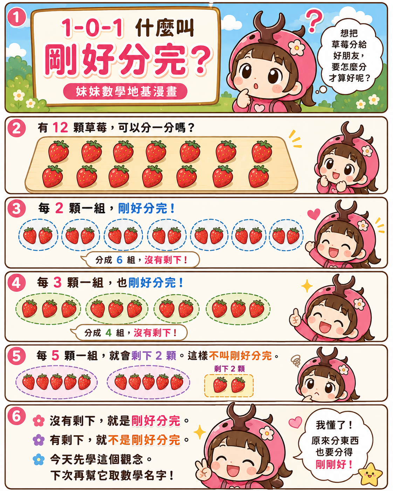
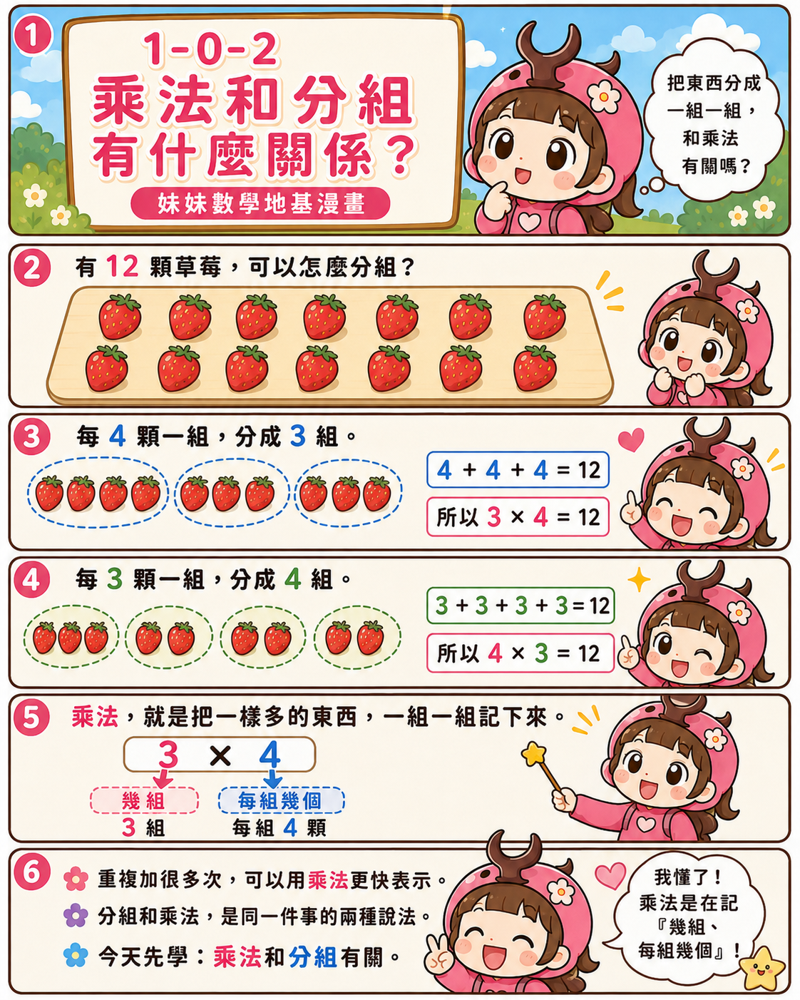
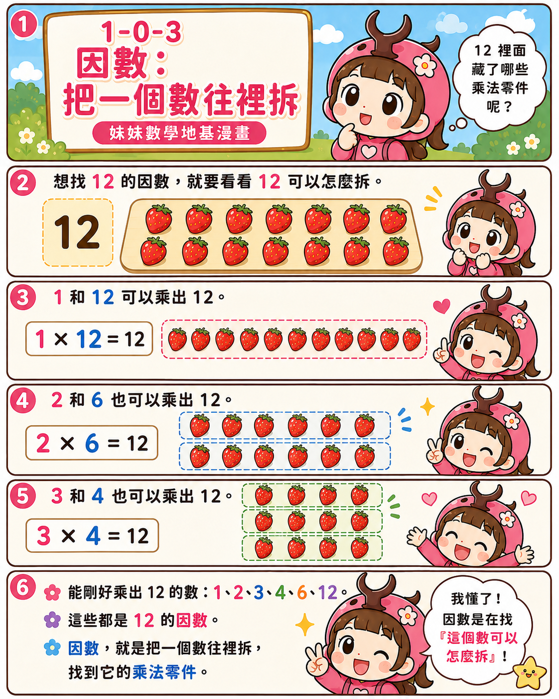
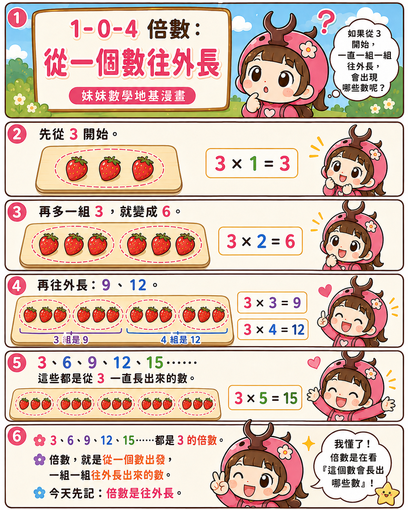
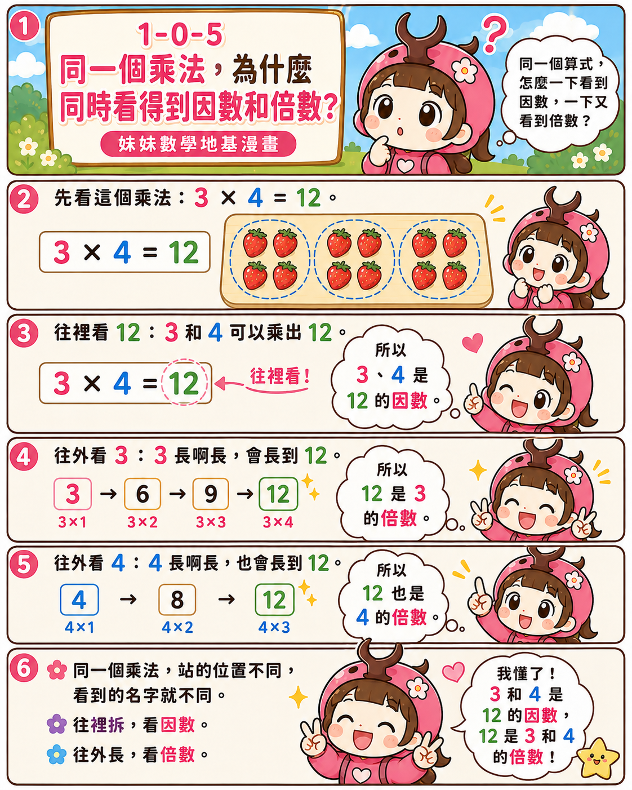
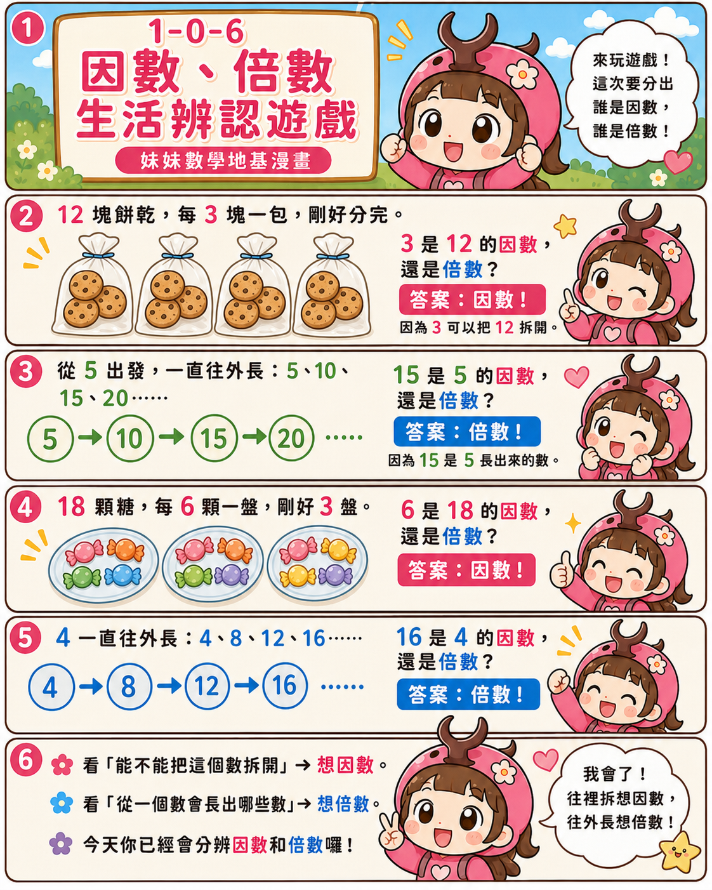
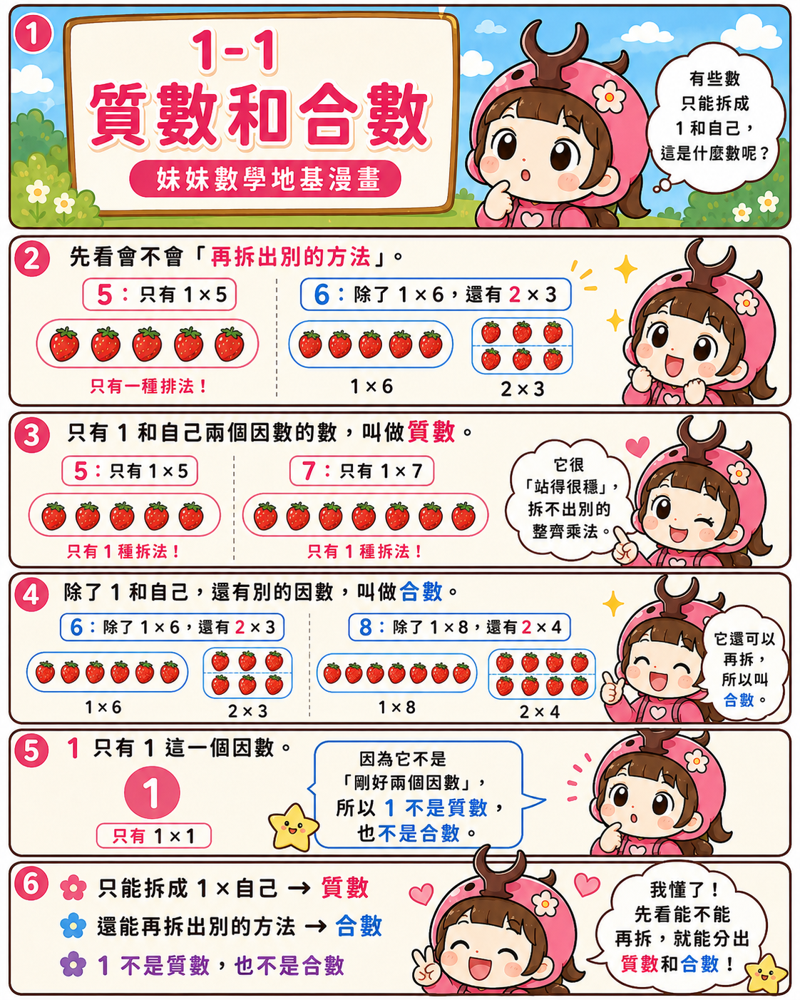
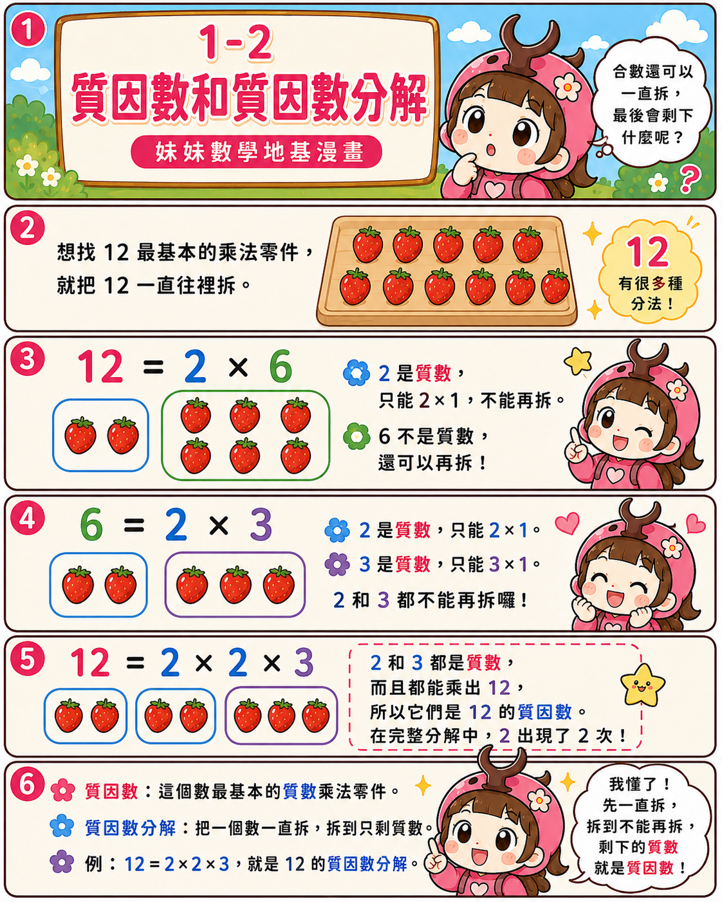
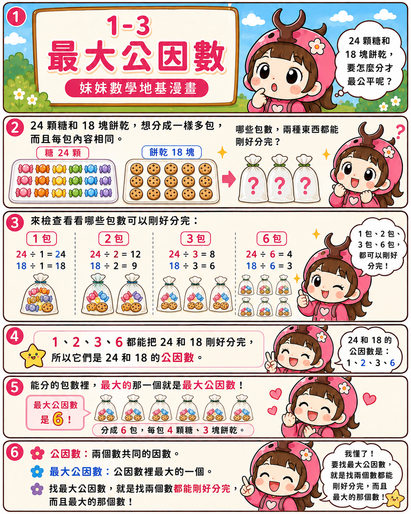
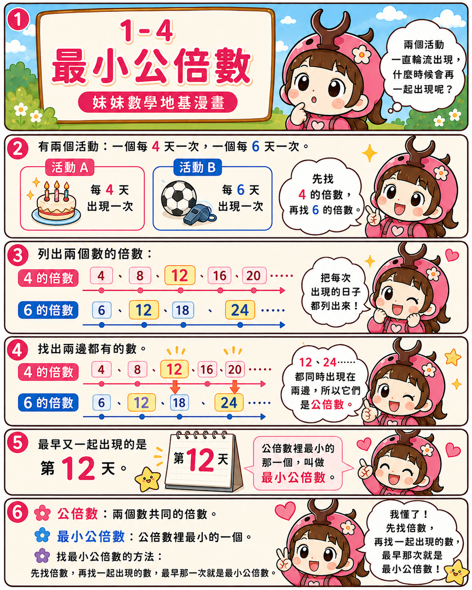

<div align="center">

# 🪲 Beetle Math Lab

## 獨角仙妹妹的數學思考漫畫

### Factors & Multiples Foundation｜因數與倍數 N-0 地基篇
### Factors & Multiples｜因數與倍數篇
### Multiples Detective｜倍數偵探篇

> **不急著背口訣，先把地基蓋好，再看懂規則為什麼成立。**

</div>

---

## 🌸 這裡記錄什麼？

這是獨角仙妹妹的數學學習紀錄。

在進入課本的新觀念以前，我們先用 **N-0 地基漫畫**，把容易混淆的基礎概念一個一個補起來：

- 什麼叫「剛好分完」？
- 乘法和分組有什麼關係？
- 什麼是因數？
- 什麼是倍數？
- 為什麼同一個乘法算式，可以同時看到因數和倍數？

地基穩固以後，再進入因數與倍數的新觀念：

- 怎麼分辨質數和合數？
- 什麼是質因數與質因數分解？
- 怎麼找最大公因數？
- 怎麼找最小公倍數？

接著，再把抽象的數字變成可以看見的「積木」與「整包」，陪妹妹一步一步理解：

- 為什麼判斷倍數時，可以只檢查最後幾位？
- 前面的數字真的被忽略了嗎？
- 2、3、4、5、6、8、9、15 的倍數規則為什麼成立？

這裡不只記錄答案，也保留思考、拆解與重新推理的過程。

---

## 🧱 因數與倍數 N-0 地基漫畫

### 1-0-1｜什麼叫剛好分完？

從 12 顆草莓開始分組：每組 2 顆或 3 顆都沒有剩下；每組 5 顆會剩下 2 顆。先看懂「沒有剩下」，才開始學整除、因數和倍數。



---

### 1-0-2｜乘法和分組有什麼關係？

同樣是 12 顆草莓，可以看成 3 組、每組 4 顆，也可以看成 4 組、每組 3 顆。乘法是在記錄「幾組、每組幾個」。



---

### 1-0-3｜因數：把一個數往裡拆

想找 12 的因數，就找哪些數可以兩兩相乘得到 12。能剛好乘出 12 的 1、2、3、4、6、12，都是 12 的因數。



---

### 1-0-4｜倍數：從一個數往外長

從 3 出發，一組一組往外增加，就會得到 3、6、9、12、15……這些都是 3 的倍數。



---

### 1-0-5｜同一個乘法，同時看到因數和倍數

在 `3 × 4 = 12` 裡，往結果 12 裡面拆，可以看到 3、4 是 12 的因數；從 3 或 4 往外長，也可以看到 12 是它們的倍數。



---

### 1-0-6｜因數、倍數生活辨認遊戲

用餅乾分包、糖果分盤和數字往外長的生活題，練習判斷現在是在「往裡拆、想因數」，還是「往外長、想倍數」。



---

## 🌿 因數與倍數新觀念漫畫

### 1-1｜質數和合數

先看一個數除了 `1 × 自己`，還能不能拆出別的整齊乘法。只有 1 和自己兩個因數的是質數；還有其他因數的是合數；而 1 既不是質數，也不是合數。



---

### 1-2｜質因數和質因數分解

把合數一直往裡拆，直到所有乘法零件都成為不能再拆的質數。像 `12 = 2 × 2 × 3`，就是 12 的質因數分解。



---

### 1-3｜最大公因數

找出兩個數都能剛好分完的包數，這些數是它們的公因數；其中最大的一個，就是最大公因數。



---

### 1-4｜最小公倍數

先分別列出兩個數的倍數，再找兩邊共同出現的數；最早共同出現的那一個，就是最小公倍數。



---

## 🎒 先認識「整包」

例如，12 顆草莓每 3 顆裝成一包，可以剛好裝成 4 包，沒有剩下：

```text
12 = 3 × 4
```

所以，**12 是 3 的倍數**，而 **3 是 12 的因數**。

漫畫裡說的「打包」，就是把一群東西按照相同數量分成一包；如果全部都能裝完、沒有剩下，就代表它能被這個數整除。

而「十進位整包」是利用：

```text
10 = 2 × 5
100 = 4 × 25
1000 = 8 × 125
```

因此：

- 每個 10 一定能被 2 和 5 分完。
- 每個 100 一定能被 4 分完。
- 每個 1000 一定能被 8 分完。

前面的數字不是消失，也不是被忽略，而是它們已經被證明能完整分包，所以只需繼續檢查尚未確定的部分。

---

## 🔎 倍數偵探漫畫

### ① 什麼是倍數？

先從草莓分包開始，理解「倍數」就是能分成一樣大的整包，而且沒有剩下。


---

### ② 為什麼留下1位或2位？

看懂前面的十位或百位為什麼能先打包，以及真正還需要檢查的是哪一部分。


---

### ③ 三種十進位整包

利用 10、100、1000，分別找出判斷 2、4、5、8 的線索。


---

### ④ 2、5、4留下幾位？

判斷 2 和 5，只要檢查個位；判斷 4，則要把末兩位合起來檢查。


---

### ⑤ 8為什麼看末三位？

因為每個 1000 都能被 8 分完，所以前面的千位整包可以先處理，只需檢查末三位組成的數。


---

### ⑥ 9和3為什麼把數字加起來？

每個 10、100、1000 拆掉 9 的整包後，都會留下 1；這些留下來的數量加總，正好就是各位數字的總和。


---

### ⑦ 兩關任務與偵探地圖

判斷 6 要同時通過 2 和 3 兩關；判斷 15 則要同時通過 3 和 5 兩關。最後把整套推理整理成偵探地圖。


---

## 🧭 倍數偵探地圖

| 要判斷的倍數 | 檢查方式 | 為什麼？ |
|---|---|---|
| 2 | 看個位 | 10 能被 2 分完 |
| 5 | 看個位 | 10 能被 5 分完 |
| 4 | 看末兩位 | 100 能被 4 分完 |
| 8 | 看末三位 | 1000 能被 8 分完 |
| 3 | 看各位數字總和 | 10、100、1000……除以 3 都會餘 1 |
| 9 | 看各位數字總和 | 10、100、1000……除以 9 都會餘 1 |
| 6 | 同時通過 2 和 3 | 6 = 2 × 3，而且 2、3 沒有共同因數 |
| 15 | 同時通過 3 和 5 | 15 = 3 × 5，而且 3、5 沒有共同因數 |

---

## 🌱 我們的學習方式

1. **先補地基**：先分清楚「剛好分完、分組、因數、倍數」。
2. **往裡拆解**：從因數走到質數、合數與質因數分解。
3. **尋找共同**：比較兩個數共同的因數與倍數。
4. **先看見**：用草莓、積木和袋子，把數字變成具體的東西。
5. **再分包**：找出哪些部分一定能完整分完。
6. **找剩下**：只檢查還沒有被證明的部分。
7. **說出原因**：不只回答結果，也試著解釋規則為什麼成立。
8. **重新推理**：忘記口訣沒關係，可以從整包概念再推一次。

---

<div align="center">

### 🪲 往裡拆，找到因數；往外長，找到倍數。

### 真正的偵探，不只記得規則，也知道規則為什麼成立。

</div>
